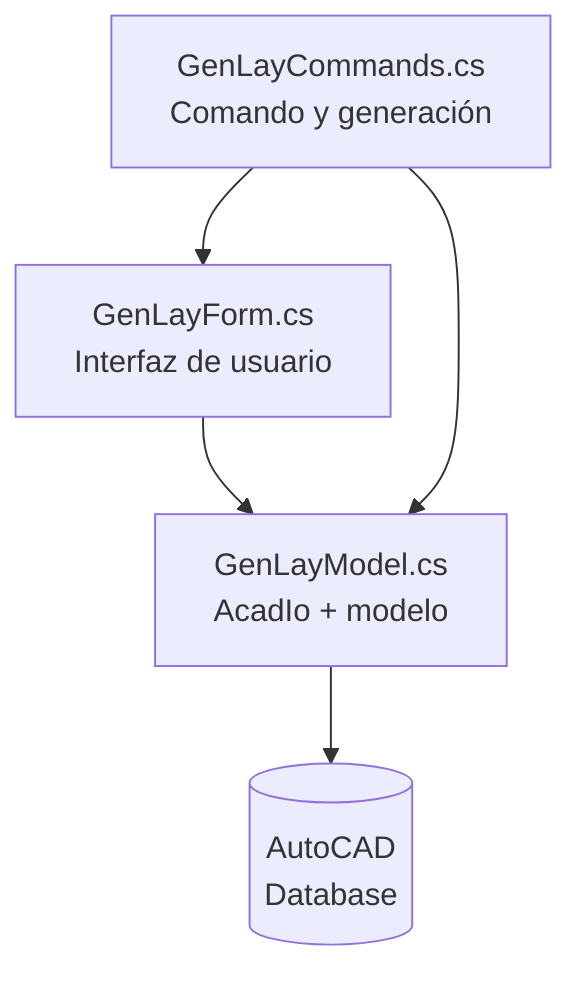
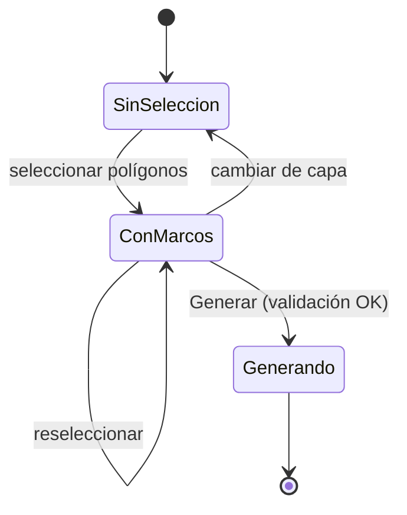

# GENLAY — Arquitectura y especificación funcional

**Proyecto:** GenLay (antes `CreateViewLayouts`)
**Autor:** AGRDB — AGR Digital Building
**Plataforma:** AutoCAD 2024 · .NET API (ObjectARX managed) · .NET Framework 4.8
**Estado del documento:** actualizado a la versión 1.0.0 del código

---

## 1. Propósito

Generar automáticamente hojas de plano (*layouts*) a partir de polilíneas cerradas dibujadas en el modelo, que actúan como marcos de encuadre. Cada polilínea produce una hoja clonada de un layout plantilla, con su viewport centrado, a escala fija y bloqueado.

El caso de uso que originó la herramienta ronda las **38 hojas** y se proyecta a **100 o más**, lo que descarta el trabajo manual y justifica un plugin compilado en lugar de una rutina AutoLISP.

---

## 2. Flujo funcional

```
GENLAY
│
├─ Abrir diálogo
│   ├─ Leer capas del dibujo
│   └─ Leer layouts existentes
│
├─ Escoger capa de los marcos
├─ Seleccionar polilíneas (filtradas por capa)
├─ Escoger layout base
├─ Escoger escala y unidades del modelo
├─ Definir prefijo, numeración inicial y orden
│
└─ Generar (por cada marco)
    ├─ Clonar el layout base
    ├─ Activar el layout
    ├─ Aplicar escala fija al viewport
    ├─ Centrar el viewport en el marco
    ├─ Bloquear el viewport
    └─ Nombrar: 01, 02, 03 ...  (con prefijo opcional: PR-01, PR-02 ...)
```

---

## 3. Arquitectura

Tres capas, una por archivo. La separación permite reutilizar la lógica de AutoCAD desde otro punto de entrada (script, comando sin diálogo, tarea batch) sin tocar la interfaz.



| Archivo | Responsabilidad | No debe contener |
|---|---|---|
| `GenLayModel.cs` | `FrameInfo`, `LayerInfo`, `FrameOrder`, `AcadIo`. Toda transacción con la base de datos, toda interacción con el editor, el ordenamiento de marcos y el armado de nombres de hoja. | Ningún control de WinForms |
| `GenLayForm.cs` | Construcción de la ventana, validación de entradas, vista previa. | Ninguna `Transaction` directa |
| `GenLayCommands.cs` | Punto de entrada `[CommandMethod]` y creación de layouts. Pide el ordenamiento a `AcadIo.SortFrames`. | Ningún prompt de línea de comando |

### 3.1 Modelo de datos

```csharp
public class FrameInfo
{
    public ObjectId Id;      // la polilínea de origen
    public Point3d  Center;  // centro del bounding box, unidades del modelo
    public double   Width;   // unidades del modelo
    public double   Height;  // unidades del modelo
    public string   Layer;
}

public class LayerInfo
{
    public string Name;
    public System.Drawing.Color Color;  // color real de la capa
    public bool   Usable;               // ni apagada ni congelada
    public bool   IsAll;                // item "(Todas las capas)"
}

public enum FrameOrder
{
    UserPick,   // orden en que el usuario seleccionó los marcos
    ByColumns,  // avanza en X: columnas de izquierda a derecha, cada una de arriba a abajo
    ByRows      // avanza en Y: filas de arriba a abajo, cada una de izquierda a derecha
}
```

### 3.2 Contrato de `AcadIo`

| Método | Devuelve | Notas |
|---|---|---|
| `GetLayers()` | `List<LayerInfo>` | El primer elemento es siempre `(Todas las capas)` |
| `GetLayoutNames()` | `List<string>` | Excluye `Model`, orden alfabético |
| `GetCurrentLayoutName()` | `string` | `null` si el layout activo es `Model` |
| `PickFrames(layer, out skipped)` | `List<FrameInfo>` | `null` si el usuario cancela con ESC. Conserva el orden de selección |
| `SortFrames(frames, order)` | `void` | Ordena la lista in situ según `FrameOrder` |
| `BuildSheetName(prefix, number)` | `string` | Fuente única del nombre de hoja; la usan la vista previa y la creación |

Constantes: `NumberFormat = "D2"` (dígitos del número de hoja), `DefaultPrefix = ""` y `AllLayersLabel`.

---

## 4. Especificación de la interfaz

Ventana modal, no redimensionable, 480 × 616 px, construida **por código** — sin `.Designer.cs` ni `.resx`, para evitar conflictos al migrar de framework.

### 4.1 Grupo 1 — Marcos en el modelo

| Control | Tipo | Comportamiento |
|---|---|---|
| Capa de los marcos | ComboBox *owner-drawn* | Muestra el color real de cada capa en un cuadro de 12 px. Las capas apagadas o congeladas aparecen en gris con la nota "apagada o congelada" |
| Seleccionar polígonos… | Button | Oculta el diálogo, ejecuta la selección filtrada, restaura el diálogo |
| Contador | Label 12 pt bold | `Sin polígonos seleccionados` → `38 vistas por crear` |
| Info de descarte | Label gris | `n descartado(s)` cuando hay polilíneas abiertas o sin área |

### 4.2 Grupo 2 — Hoja y escala

| Control | Tipo | Valor por defecto |
|---|---|---|
| Layout base | ComboBox (lista cerrada) | El layout activo, o el primero |
| Leyenda | Label gris | `Se clonará "X" 38 veces` |
| Escala 1: | ComboBox editable | `100` — sugiere 25, 50, 75, 100, 200, 250, 500, 1000, 2000 |
| Unidades del modelo | ComboBox | `Metros` |
| Prefijo de hoja | TextBox | Vacío (opcional) |
| Iniciar en | NumericUpDown | `1` (1–9999) |
| Orden | RadioButton ×3 | `Por columnas` — además `Por filas` y `Según selección`, cada uno con *tooltip* |
| Ajustar viewport al marco | CheckBox | Desmarcado |

### 4.3 Grupo 3 — Vista previa

ListBox de solo lectura con los nombres exactos que se generarán. Se recalcula en vivo al cambiar prefijo o numeración inicial. Los nombres en conflicto se marcan en la lista y se cuentan en una etiqueta roja inferior.

### 4.4 Máquina de estados



**Regla:** cambiar de capa descarta la selección previa y devuelve el contador a cero. Evita generar hojas con marcos de una capa que ya no corresponde.

**Regla:** el botón *Generar* permanece deshabilitado mientras no haya al menos un marco.

### 4.5 Validaciones antes de generar

1. Al menos un marco seleccionado
2. Layout base seleccionado
3. Escala numérica mayor que cero — acepta coma o punto como separador decimal (configuración regional de Colombia)
4. Prefijo opcional; si se escribe, sin los caracteres `< > / \ " : ; ? * | , = \``

---

## 5. Algoritmos

### 5.1 Escala y unidades

`ViewHeight` está en unidades de **modelo**; `Viewport.Height` en unidades de **papel** (mm).

```
ViewHeight = Viewport.Height × denominador ÷ factorUnidades
```

| Unidades del modelo | factorUnidades |
|---|---|
| Metros | 1000 |
| Centímetros | 10 |
| Milímetros | 1 |
| Pies | 304.8 |

Con el redimensionado activo:

```
Viewport.Width  = Frame.Width  × factorUnidades ÷ denominador
Viewport.Height = Frame.Height × factorUnidades ÷ denominador
```

> `CustomScale` y `ViewHeight` son la misma magnitud vista desde dos lados (`CustomScale = Height / ViewHeight`). Asignar ambas es redundante y la segunda sobrescribe a la primera. **Se usa solo `ViewHeight`.**

### 5.2 Ordenamiento

**Por columnas (por defecto):** agrupación en bandas verticales con tolerancia igual a la mitad del ancho promedio de los marcos; las columnas se recorren de izquierda a derecha y dentro de cada una de arriba a abajo.

**Por filas:** agrupación en bandas horizontales con tolerancia igual a la mitad de la altura promedio de los marcos; las filas se recorren de arriba a abajo y dentro de cada una de izquierda a derecha.

**Según selección:** no reordena; respeta el orden en que el usuario eligió los marcos.

En los dos primeros se agrupa primero y se ordena después, en vez de usar un comparador con tolerancia — un comparador así no es transitivo y produce resultados inestables.

### 5.3 Nombres

`prefijo + (inicio + i)` con dos dígitos (`AcadIo.NumberFormat = "D2"`): `01`, `02`, … o `PR-01`, `PR-02`, … si se escribe prefijo. Si el nombre ya existe, se sufija `_2`, `_3`, hasta encontrar uno libre.

La vista previa del diálogo y la creación real usan el mismo método, `AcadIo.BuildSheetName`.

---

## 6. Invariantes de la API de AutoCAD

Reglas que no se pueden violar sin romper el comando. Documentadas porque cada una costó un fallo real.

| # | Regla | Consecuencia de incumplirla |
|---|---|---|
| 1 | `CloneLayout` **fuera** de cualquier transacción abierta | Layouts fantasma, `eWasOpenForRead`, corrupción del diccionario |
| 2 | Activar el layout (`CurrentLayout` + `TILEMODE = 0`) antes de tocar su viewport | El viewport clonado conserva `Number = 0`; no se distingue del papel y `On = true` lanza excepción |
| 3 | Desbloquear (`Locked = false`) antes de asignar `ViewCenter` / `ViewHeight` | Los cambios se descartan en silencio y las hojas salen sin encuadrar |
| 4 | Abrir el contenido del layout `ForRead` y hacer `UpgradeOpen()` solo sobre el viewport elegido | Abrir todo `ForWrite` bloquea entidades innecesariamente |
| 5 | `Application.ShowModalDialog(form)`, nunca `form.ShowDialog()` | El diálogo queda detrás de la ventana principal o congela AutoCAD |
| 6 | Ocultar el formulario + `MainWindow.Focus()` + `LockDocument()` antes de `GetSelection` | La selección no recibe clics, o `eLockViolation` |
| 7 | `catch (System.Exception)` calificado | Error de compilación: `Exception` es ambigua con `Autodesk.AutoCAD.Runtime.Exception` |
| 8 | Copiar localmente = **False** en las tres DLL de AutoCAD | Los tipos se cargan dos veces; falla en ejecución aunque compile |

---

## 7. Configuración del proyecto

### 7.1 Framework según versión de AutoCAD

| AutoCAD | Serie | TargetFramework |
|---|---|---|
| 2026 | R25.1 | `net8.0-windows` |
| 2025 | R25.0 | `net8.0-windows` |
| 2024 | R24.3 | `net48` |
| 2023 | R24.2 | `net48` |
| 2022 | R24.1 | `net48` |
| 2021 | R24.0 | `net48` |

Este proyecto está fijado en **AutoCAD 2024 / `net48`**, que es la versión en la que se compiló y probó. `PackageContents.xml` declara la serie R24.3.

El error *«`MarshalByRefObject` está definido en `System.Runtime` pero no se encontró»* es la firma exacta de un proyecto .NET Framework referenciando DLL de .NET 8.

### 7.2 Plataforma

`PlatformTarget = x64`. Las DLL de AutoCAD son AMD64; compilar en *Any CPU* produce el aviso de desajuste MSIL/AMD64 y fallos en ejecución.

### 7.3 Referencias

| Referencia | Aporta |
|---|---|
| `accoremgd.dll` | `Autodesk.AutoCAD.Runtime` — `CommandMethod`, `CommandFlags` |
| `acmgd.dll` | `ApplicationServices`, `EditorInput`, `LayoutManager` |
| `acdbmgd.dll` | `DatabaseServices`, `Geometry`, `Colors` |
| `System.Windows.Forms` | El diálogo |
| `System.Drawing` | Colores de capa, dibujado del combo |

> `LayoutManager` pertenece al namespace `DatabaseServices` pero vive en `acmgd.dll`, no en `acdbmgd.dll`.

Las tres DLL se buscan en `$(AutoCADDir)`, que por defecto es `C:\Program Files\Autodesk\AutoCAD 2024`. Una instalación en otra carpeta se indica en `GenLay.local.props`, junto al `.csproj`; ese archivo es local y no se versiona.

Las tres DLL de AutoCAD van con **Copiar localmente = False**. En proyecto SDK-style, `System.Windows.Forms` y `System.Drawing` no se agregan a mano: basta `<UseWindowsForms>true</UseWindowsForms>`.

---

## 8. Estructura del repositorio

```
GenLay/
├─ README.md
├─ ARQUITECTURA.md
├─ LICENSE
├─ .gitignore
├─ GenLay.sln
├─ GenLay.csproj
├─ PackageContents.xml
├─ GenLayModel.cs
├─ GenLayForm.cs
├─ GenLayCommands.cs
└─ docs/
   └─ genlay-dialogo.png
```

`bin/`, `obj/`, `.vs/` y `GenLay.local.props` quedan fuera del repositorio. El bundle de despliegue se arma a partir de `PackageContents.xml` y la DLL compilada:

```
GenLay.bundle/
├─ PackageContents.xml
└─ Contents/
   └─ GenLay.dll
```

---

## 9. Despliegue

Copiar `GenLay.bundle` completa a:

```
%APPDATA%\Autodesk\ApplicationPlugins\
```

Con `LoadOnCommandInvocation="True"`, la DLL solo se carga cuando se escribe `GENLAY`, sin penalizar el arranque de AutoCAD.

> Hay reportes de que AutoCAD 2026 dejó de cargar plugins desde la ruta de `ProgramData`. La ruta de usuario (`%APPDATA%`) funciona en todas las versiones.

---

## 10. Decisiones tomadas y sus alternativas

| Decisión | Alternativa descartada | Razón |
|---|---|---|
| C# / .NET | AutoLISP | Volumen de hojas, mantenibilidad, empaquetado como producto |
| C# / .NET | pyautocad / COM | COM no tiene clonado de layout; fuera de proceso; librería sin mantenimiento |
| C# / .NET | PyRx | Opción válida y en proceso, pero añade una dependencia al usuario final |
| Diálogo único | Prompts en línea de comando | Se necesita mostrar el conteo de vistas y la vista previa de nombres |
| Formulario por código | Diseñador visual | Evita `.Designer.cs` y `.resx` al migrar de framework |
| Filtro por capa | Selección libre | Los marcos viven en una capa dedicada; reduce errores de selección |

---

## 11. Pendientes

- [x] Confirmar la versión de AutoCAD objetivo y fijar el `TargetFramework` — AutoCAD 2024, `net48`
- [ ] Variante `net8.0-windows` para AutoCAD 2025 / 2026
- [ ] La vista previa anuncia el sufijo `_2` para un nombre repetido aunque el nombre final pueda ser `_3` o posterior
- [ ] Manejo de marcos rotados: hoy el encuadre usa el *bounding box* ortogonal; con marcos girados habría que leer la extensión en el sistema del marco y aplicar `TwistAngle`
- [ ] Escala individual por marco (existía en la versión previa, no se ha reintegrado al diálogo)
- [ ] Escritura de atributos del rótulo — número de hoja, escala, fecha
- [ ] `launchSettings.json` para depurar con F5 lanzando `acad.exe`
- [ ] Índice de planos exportable a CSV/Excel, como puente hacia los flujos GIS/BIM
- [ ] Registro del comando en la cinta de opciones (requiere `AdWindows.dll` y `AcCui.dll`)
