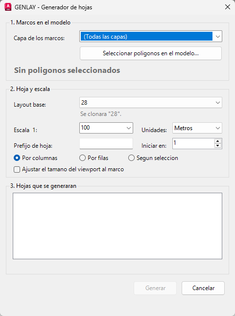

# GenLay

Plugin de AutoCAD en C# que genera hojas (layouts) automáticamente a partir de marcos dibujados en el modelo.

Dibujas una polilínea cerrada por cada plano que necesitas, ejecutas `GENLAY`, y el plugin clona un layout base una vez por marco, centra el viewport en cada uno a la escala indicada y numera las hojas.



## Qué hace

- Lee los marcos (polilíneas cerradas) del modelo, con filtro opcional por capa.
- Clona el layout base una vez por marco y ajusta el viewport principal: centro, escala y, si se pide, tamaño.
- Ordena las hojas por columnas, por filas o en el orden de selección. El agrupamiento tolera marcos que no están perfectamente alineados.
- Numera las hojas con prefijo opcional y número inicial, y muestra la lista antes de crear nada.
- Detecta nombres de layout que ya existen y crea la hoja con sufijo (`05_2`) en lugar de fallar.
- Deja cada viewport bloqueado al terminar.

## Requisitos

| | |
|---|---|
| AutoCAD | 2024 (probado). También Civil 3D 2024 y demás verticales basados en AutoCAD 2024 |
| Framework | .NET Framework 4.8 |
| Sistema | Windows 64 bits |

AutoCAD 2025 y 2026 usan .NET 8, así que para esas versiones hay que recompilar cambiando `TargetFramework` a `net8.0-windows` y apuntando a sus DLL. Esa variante no está probada.

## Compilar

1. Abre `GenLay.sln` en Visual Studio 2022.
2. Compila en `Release | x64`.

El proyecto busca las DLL de AutoCAD (`accoremgd`, `acdbmgd`, `acmgd`) en `C:\Program Files\Autodesk\AutoCAD 2024`. Si tu instalación está en otra carpeta, crea un archivo `GenLay.local.props` junto al `.csproj` (no se versiona):

```xml
<Project>
  <PropertyGroup>
    <AutoCADDir>D:\Ruta\AutoCAD 2024</AutoCADDir>
  </PropertyGroup>
</Project>
```

## Instalar

**Carga manual.** En AutoCAD ejecuta `NETLOAD` y elige `GenLay.dll`.

**Carga automática.** Arma esta carpeta y cópiala en `%APPDATA%\Autodesk\ApplicationPlugins\`:

```
GenLay.bundle\
    PackageContents.xml
    Contents\
        GenLay.dll
```

El comando se carga la primera vez que escribes `GENLAY`.

## Uso

1. En el modelo, dibuja una polilínea cerrada por cada hoja.
2. Prepara un layout base con su rótulo y un viewport flotante.
3. Ejecuta `GENLAY`.
4. Elige la capa de los marcos y pulsa **Seleccionar polígonos en el modelo**.
5. Indica layout base, escala, unidades del dibujo, prefijo y número inicial.
6. Revisa la lista de hojas y pulsa **Generar**.

| Opción | Efecto |
|---|---|
| Por columnas | Baja cada columna de arriba a abajo y pasa a la de la derecha |
| Por filas | Recorre cada fila de izquierda a derecha y baja a la siguiente |
| Según selección | Respeta el orden en que seleccionaste los marcos |
| Ajustar el tamaño del viewport al marco | Redimensiona el viewport al tamaño del marco a la escala elegida |

Si el layout base tiene varios viewports, se usa el de mayor área.

## Estructura del código

| Archivo | Contenido |
|---|---|
| `GenLayCommands.cs` | Comando `GENLAY` y creación de los layouts |
| `GenLayModel.cs` | Lectura de capas, layouts y marcos; ordenamiento; nombres de hoja |
| `GenLayForm.cs` | Diálogo WinForms, construido por código |
| `PackageContents.xml` | Manifiesto para la carga automática |

La interfaz no abre transacciones: todo el acceso a la base de datos de AutoCAD pasa por la clase `AcadIo`.

El diseño, los algoritmos y las reglas de la API de AutoCAD que el código respeta están en [ARQUITECTURA.md](ARQUITECTURA.md).

## Limitaciones

- Usa la caja envolvente del marco, así que un marco girado se trata como su rectángulo alineado a los ejes.
- La vista del viewport queda en planta, sin giro.
- La numeración usa dos dígitos (`01`, `02`...). Se cambia en `AcadIo.NumberFormat`.

## Autor

Andrés G. Rodríguez · [AGRDB – AGR Digital Building](https://agrdb.com)

## Licencia

[MIT](LICENSE)
